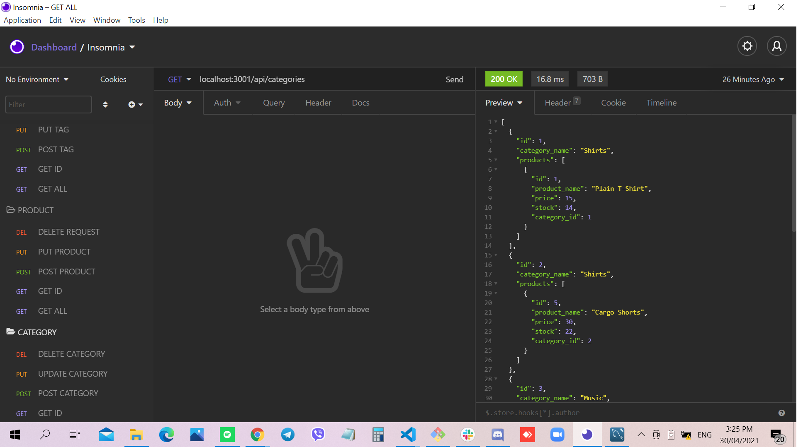

# ORM: E-Commerce Back End

## Site Picture


## Technologies Used
- Javascript - adds special effects on pages
- Node.js - an open source server environment that uses JavaScript on the server
- MySQL - fully managed database service to deploy cloud-native applications.
- GitBash - for cloning repository and pushing code to GitHub
- GitHub - holds repository that deploys to GitHub Pages

## Summary
This file contains code that uses Object-Relational Mapping that creates an E-Commerce Back End. It also contains code that was created using Javascript and Node.js. 

## Code Snippet
```javascript
router.get('/', async (req, res) => {
  try {
    const categoryData = await Category.findAll( {
      include: [{ model: Product }]
    });

    if (!categoryData) {
      res.status(404).json({ message: 'No category found with this id!' });
      return;
    }

    res.status(200).json(categoryData);
  } catch (err) {
    res.status(500).json(err);
  }
});
 ```

```javascript
<javascript>

</javascript>
```

## Video
https://drive.google.com/file/d/1Tr-OKamZf8HVG_QsNI0_sa1EOp9hj-QS/view

## Author Links 
[LinkedIn](https://www.linkedin.com/in/rosario-miranda-b81170132/)<br />
[GitHub](https://github.com/rtmiranda18)
